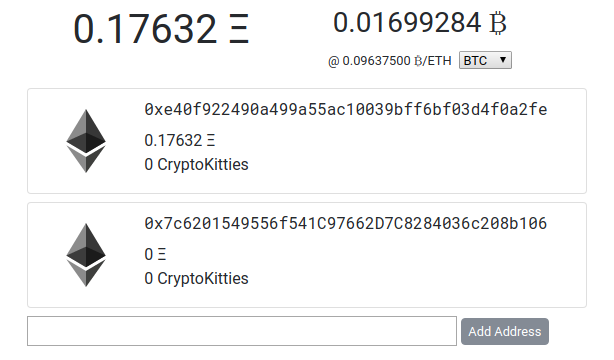

# Wall Monitor

Wall Monitor provides at-a-glance information on your crypto wallets.

## Features
* Add new addresses easily
* Currently supports Ethereum wallet addresses and MetaMask
* Wallet balances + grand total + exchange rates
* ERC20 & ERC721 token balances
* Offers exchange rates in over 150 currencies and commodities.

### Supported Tokens
* CryptoKitties (CK)

## Why? What about MEW? Or Etherscan watchlists?

I wanted to this to be about monitoring. It had to be fast, intuitive, and easy
to read. MEW and Etherscan aren't really good at these.

Besides, why not?

## Usage

MetaMask is required for both Online and Offline usage currently. Support for custom/local nodes coming soon (maybe).

### Online
1. Head to https://wallmonitor.ca
2. Set your desired exchange currency.
3. Add your wallet addresses.
4. Bookmark the page for future reference.

Note: There is a risk that someone could intercept your Ethereum wallet addresses and see your transaction history (but not access your funds). If you're paranoid, use the offline method.

### "Offline"
1. Download or clone the repo to someplace memorable.
2. Open `index.html` in your browser.
3. Set your desired exchange currency.
4. Add your wallet addresses.
5. Bookmark the page for future reference.
